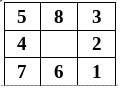
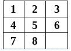
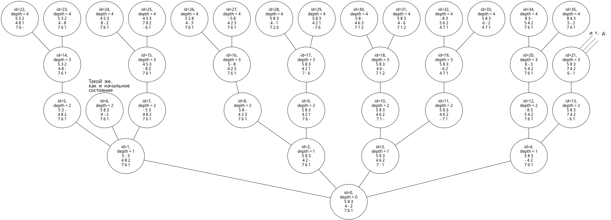
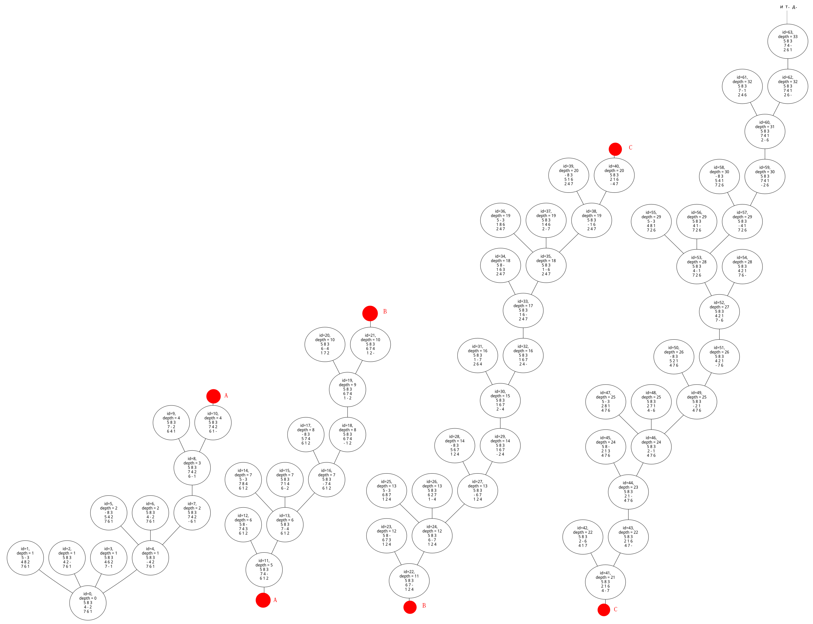
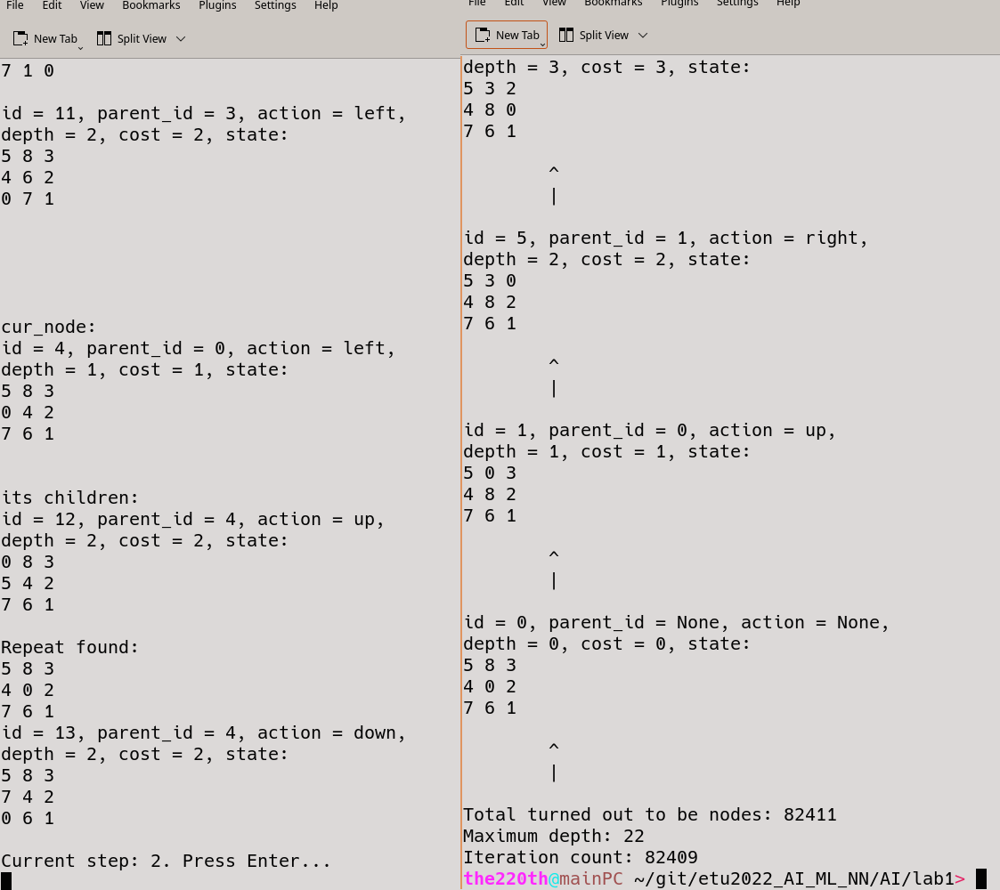
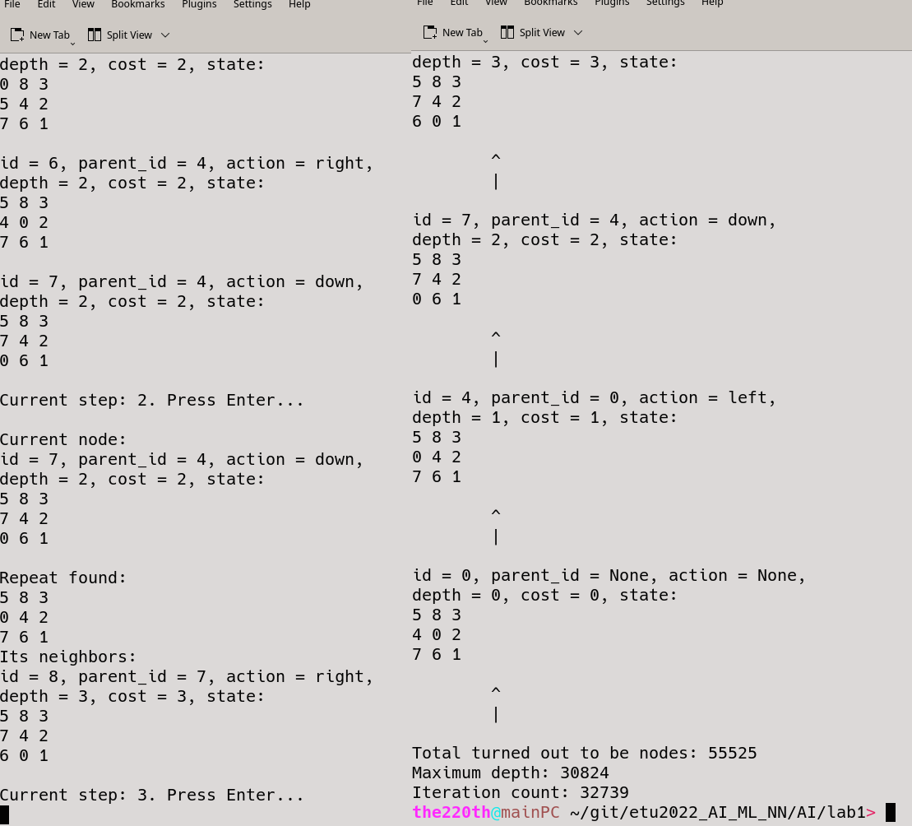
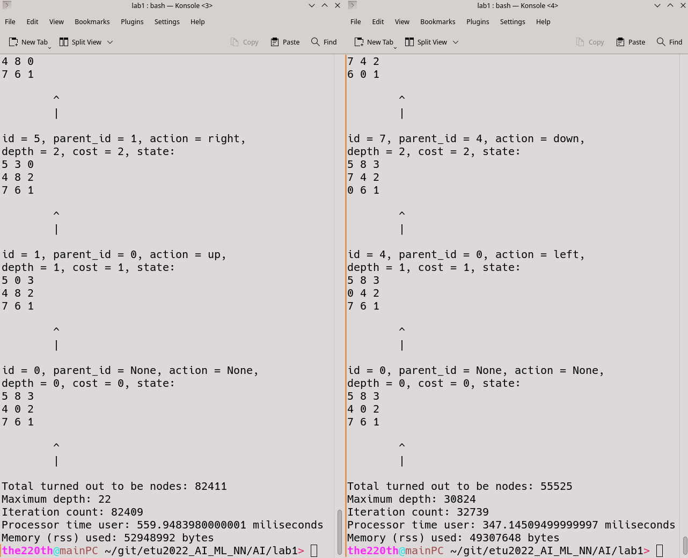

# ВВЕДЕНИЕ

Цель работы: практическое закрепление понимания общих идей поиска в пространстве состояний и стратегий слепого поиска.

Задачи:

1. Формализовать состояния (выбрать структуру данных). Определить функцию последователей и функцию достижения целевого состояния.

1. Реализовать на любом императивном языке программирования алгоритм поиска решения головоломки «8-ка» с использованием двух заданных стратегий для заданных исходного и целевого состояний. 

1. Отладить программу.

1. Провести эксперемент. Далее экспериментальным путем оценить временную и емкостную сложность решения задачи для двух заданных стратегий. Сравнить теоретический анализ порядка сложности с экспериментальным


Вариант 1:

Начальное состояние:



Конечное (целевое) состояние:



Стратегии поиска:

в глубину, в ширину.

# Описание выбранных структуд данных, представления функции определения последователей

Было решено, что состояния будут представляться массивом на 9 элементов. Пропуск (пустое место) будет обозначаться числом 0. Например, начальное состояние будет представляться, как массив из 9 элементов: [5, 8, 3, 4, 0, 2, 7, 6, 1].

Описание структур данных представлено в таблице 1.

Таблица 1 — описание структур данных

<table border='1'>

<tr>
    <td><b>Структура</b></td>
    <td><b>Описание</b></td>
</tr>

<tr>
    <td>Node</td>
    <td>Пользовательская структура, которая описывает узел. Его поля:
    cur_state - состояние, 
    parent_node - родитель, 
    prev_action - действие, 
    path_cost = стоимость пути, 
    depth = глубина, 
    node_id = id узла.</td>
</tr>

<tr>
    <td>Словарь</td>
    <td>Словарь используется для хранения узлов. Ключом в словаре используется глубина, по ключу можно получить список (на основе массива), в котором будут находиться узлы на этом уровне. </td>
</tr>

<tr>
    <td>Хешированное множество</td>
    <td>Хешированное множество (set). Set используется для хранения хешей состояний. Таким образом можно за O(1) проверить, что такое состояние уже существует. </td>
</tr>

<tr>
    <td>Стэк</td>
    <td>Стэк используется для поиска в глубину (DFS). Рекурсивный DFS не получилось адекватно реализовать, так как переполняется стэк вызова функций, поэтому был реализован итеративный DFS, где и используется стэк. </td>
</tr>

</table>

Функция достижения конечного состояния `check_final` проверяет поэлементно массивы из 9 элементов, представляющие состояния: текущее и конечное.

``` python
# O(1)
def check_state_equals(state1: list, state2: list) -> bool:
    for i in range(9):
        if(state1[i] != state2[i]):
            return False
    return True

# O(1)
def check_final(cur_state: list) -> bool:
    if(check_state_equals(cur_state, get_final_state()) == True):
        return True
    else:
        return False
```

Функция определения последователей `get_next_states` пытается сгенерировать следующие все возможные состояния.

``` python
class Actions(enum.Enum):
    up = 1
    right = 2
    down = 3
    left = 4

# O(1)
def state_swap(state: list, i: int, j: int) -> list:
    res = list(state)
    res[i], res[j] = res[j], res[i]
    return res

# O(1)
# return new state or None
def shift_state(cur_state: list, where: "Actions") -> list:
    # 0 1 2
    # 3 4 5 
    # 6 7 8
    i = cur_state.index(0)

    if(where == Actions.up):
        if(i in (0, 1, 2)):
            return None
        else:
            return state_swap(cur_state, i, i-3)
    elif(where == Actions.right):
        if(i in (2, 5, 8)):
            return None
        else:
            return state_swap(cur_state, i, i+1)
    elif(where == Actions.down):
        if(i in (6, 7, 8)):
            return None
        else:
            return state_swap(cur_state, i, i+3)
    elif(where == Actions.left):
        if(i in (0, 3, 6)):
            return None
        else:
            return state_swap(cur_state, i, i-1)
    else:
        print("Failed successfully (shift_state)")

# O(1)
def get_next_states(cur_state: list) -> dict:
    res = {}
    for action_i in Actions:
        cur_state_i = shift_state(cur_state, action_i)
        if(cur_state_i != None):
            res[action_i] = cur_state_i
    return res
```

# Описание алгоритма

## Обход в ширину

Обход в ширину (BFS). Суть его такова: сначала раскрывается вершина – корень в дереве поиска, затем все вершины – непосредственные потомки корня, вершины глубины d раскрываются раньше, чем вершины глубины (d+1), пока есть хотя бы одна вершина глубины d – нельзя раскрывать вершину на глубине d+1. 

Поиск в ширину:

- гарантирует нахождение решения, если оно существует (полная);

- первым всегда находит решение минимальной глубины.

Однако решение минимальной глубины не всегда имеет минимальную стоимость (но в данной задаче стоимость и глубина эквивалентны). Плюс ко всему недостаток поиска в ширину – большая сложность.

Пусть N - глубина результата, C - какая-то константа, тогда:

``` txt
O( SUM[C^i, i=0..N] ) = O( 1/2*(C^(N+1) - 1) ) = O(C^N)
```

Получается порядок временной сложности поиска – O(C^N). Ёмкостная сложность равна временной O(C^N). 

Ручной режим построения дерева BFS представлен на рисунке 1. 



## Обход в глубину

Обход в глубину (DFS). 

Поиск сначала в глубину всегда раскрывает одну из вершин на самом глубоком уровне дерева. Останавливается, когда поиск достигает цели или заходит в тупик (ни одна вершина не может быть раскрыта). В последнем случае выполняется возврат назад и раскрываются вершины на более верхних уровнях.

Поиск в глубину эффективнее, когда задача имеет много решений, так как в этом случае высока вероятность найти решение, исследовав малую часть пространства поиска. Недостаток поиска в глубину – способность углубляться в неверном направлении. Многие задачи имеют очень глубокие или даже бесконечные деревья поиска, в этом случае поиск в глубину никогда не может восстановиться после неудачного выбранного вблизи корня направления. Поиск в глубину обычно реализуется с помощью рекурсивной функции.

Пусть N - глубина результата, C - какая-то константа, тогда:

``` txt
O(C*N) = O(N)
```

Получается порядок временной сложности поиска – O(N). Ёмкостная сложность равна временной O(N). 

Ручной режим построения дерева DFS представлен на рисунке 2. 



# Результаты работы

Исходный код реализации представлен в приложении А. В секции `Variable section` можно настроить выполнение так, как необходимо. В том числе переключение между BFS и DFS и переключение между сквозным выполнение и пошаговым.

Примеры протоколов выполнения программ для BFS и DFS в пошаговом режиме представлены на рисунках 3 и 4.





Эксперементальный замер по времени и памяти при выполнении реализации представлен на рисунке 5.



Теоритический анализ порядка сложности алгоритмов и эксперементальные результаты представлены в таблице 2. 

Таблица 2 — Сравнительные оценки

<table border='1'>

<tr>
    <td><b>-</b></td>
    <td><b>BFS (теор)</b></td>
    <td><b>DFS (теор)</b></td>
    <td><b>BFS (эксперемент)</b></td>
    <td><b>DFS (эксперемент)</b></td>
</tr>

<tr>
    <td>Временная</td>
    <td>O(C^N)</td>
    <td>O(N)</td>
    <td>560 ms</td>
    <td>348 ms</td>
</tr>

<tr>
    <td>Ёмкостная</td>
    <td>O(C^N)</td>
    <td>O(N)</td>
    <td>51708 kB</td>
    <td>48152 kB</td>
</tr>

</table>

Хочется отметить несколько вещей. Python используют свой менеджмент памяти, поэтому показанные результаты можно интепретировать лишь с большой погрешностью. В реализации с DFS использовалась доп. структура данных - стэк, поэтому расход памяти у DFS такой высокий. Используемая память в таблице 2 приведена резидентная.

# Вывод

В ходе выполнения лабораторной работы были изучены основные стратегии неинформированного поиска. Были реализованы 2 стратегии: BFS и DFS, даны им теоритические оценки сложности. Затем был проведён эксперемент, где порядок затраченных ресурсов ПК совпадает с теоритической оценкой. После проведения эксперемента можно сделать несколько выводов:

- Как и предполагалось DFS на порядок быстрее справился с поставленной задачей.

- Как и предполагалось DFS меньше потребил ресурсов по памяти.

- Хоть DFS и быстрее, но путь, который он нашёл оставляет желать лучшего: 30824 узла против 22 у BFS.

- Пока DFS "путешествует по графу", он посещает меньше узлов: 55525 узла против 82411 у BFS.

- Если необходимо найти хоть какой-нибудь путь (сколь угодно большой длины), то лучше использовать DFS, так как он потребляет меньше ресурсов и найдёт путь быстрее. Если необходимо найти узел в дереве, который на наименьшей грубине, то лучше использовать стратегию BFS.

- И DFS, и BFS не эффективны для поиска решения игры "пятнашки" (и в общем тоже). Очевидно, что, чтобы найти искомый путь, можно посетить во много раз меньше узлов.

В итоге обязанности членов бригады распределились следующий образом:

<table border='1'>

<tr>
    <td><b>Участник бригады</b></td>
    <td><b>Его задачи</b></td>
</tr>

<tr>
    <td>Участник 1</td>
    <td>Реализация стратегий поиска, написание скрипта, проведение эксперемента по поиску эксперементальной оценки временной и ёмкостной сложности</td>
</tr>

<tr>
    <td>Участник 2</td>
    <td>Формализация задания, выбор структур данных, выбор пользовательских структур данных, оценка порядков сложностей, реализация визуализации графов</td>
</tr>

<tr>
    <td>Участник 3</td>
    <td>Распределение обязанностей, руководство при реализации стратегий, составление алгоритмов стратегий неинформированного поиска, поиск решения возникших при разработке вопросов, согласование реализации и формализации, составление отчёта</td>
</tr>

</table>

# Использованные источники

1. Рассел С, Норвиг П. Искусственный интеллект: современный подход, 2-е изд., М. «Вильямс», 2006.

2. Основы теории графов. Date Views 13.09.2022 www.stepik.org.

3. Обход в ширину. Date Views 12.09.2022 www.neerc.ifmo.ru.

4. Обход в глубину, цвета вершин. Date Views 12.09.2022 www.neerc.ifmo.ru.

# Приложение А

Исходный код скрипта:

``` python
# -*- coding: utf-8 -*-

import enum
import psutil
import os
from time import process_time

'''
============================== Variable section begin ==============================
'''    


GRAPH_VISIALISATION = True

GRAPH_VISIALISATION_FILE_NAME = "result_graph"

# False  -  BFS
# True   -  DFS
BFS_DFS = False

# Если True, то каждый шаг придётся нажимать enter
DEBUG = False

# Вариант 1
# 5 8 3
# 4 0 2
# 7 6 1
def get_init_state() -> list:
    return [5, 8, 3, 4, 0, 2, 7, 6, 1]

# Вариант 1
# 1 2 3
# 4 5 6
# 7 8 0
def get_final_state() -> list:
    return [1, 2, 3, 4, 5, 6, 7, 8, 0]


'''
============================== Variable section end ==============================
'''


class Actions(enum.Enum):
    # Actions.up.name
    # Actions.up.value
    up = 1
    right = 2
    down = 3
    left = 4


class Nodes_handler():

    #__chain = None
    __all_nodes = None

    @classmethod
    def init(cls):
        init_node = Node(get_init_state(), None, None, 0, 0)
        #cls.__chain = init_node
        cls.__all_nodes = {0: [init_node]}

    @classmethod
    def expand_chain(cls, lvl_i: int, node: "Node"):
        #prev_node = node.parent_node
        deep = node.depth
        if(lvl_i not in cls.__all_nodes):
            cls.__all_nodes[deep] = [node]
        else:
            cls.__all_nodes[deep].append(node)

    @classmethod
    def get_all_nodes(cls) -> list:
        res = []
        for k in cls.__all_nodes:
            res += cls.__all_nodes[k]
        return res

    @classmethod
    def get_nodes_on_lvl(cls, lvl: int) -> list:
        return list(cls.__all_nodes[lvl])

    @classmethod
    def get_lowest_lvl(cls) -> int:
        return max(cls.__all_nodes.keys())

    @classmethod
    def print_state(cls, state: list):
        gi = 0
        for i in range(3):
            for j in range(3):
                print(state[gi], end=" ")
                gi+=1
            print("")
    
    @classmethod
    def print_node(cls, node: "Node"):
        parent_id = None
        if(node.parent_node != None):
            parent_id = node.parent_node.node_id
        node_prev_action = None
        if(node.prev_action != None):
            node_prev_action = node.prev_action.name
        print(f"id = {node.node_id}, parent_id = {parent_id}, action = {node_prev_action}, \ndepth = {node.depth}, cost = {node.cost}, state: ")
        cls.print_state(node.cur_state)
        print("")

    @classmethod
    def print_chain(cls, node_final: "Node"):
        chain = []
        cur_node = node_final
        while(cur_node.parent_node != None):
            chain.append(cur_node)
            cur_node = cur_node.parent_node
        chain.append(cur_node)
        for node_i in chain:
            cls.print_node(node_i)
            print("\t^\n\t|\n")

class Node:

    cur_state = None
    parent_node = None
    prev_action = None
    path_cost = None
    depth = None
    node_id = None

    #@classvar
    static_node_id = 0

    def __init__(self, state: list, parent: "Node", action: "Actions", cost: int, depth: int):
        self.cur_state = state
        self.parent_node = parent
        self.prev_action = action
        self.cost = cost
        self.depth = depth

        self.node_id = Node.static_node_id
        Node.static_node_id += 1

    @classmethod
    def get_node_amount(cls) -> int:
        return cls.static_node_id + 1
        


# O(1)
def check_state_equals(state1: list, state2: list) -> bool:
    for i in range(9):
        if(state1[i] != state2[i]):
            return False
    return True

# O(1)
def check_final(cur_state: list) -> bool:
    if(check_state_equals(cur_state, get_final_state()) == True):
        return True
    else:
        return False

# O(1)
def cals_state_hash(state: list) -> int:
    hash = 7
    for i in state:
        hash = 31*hash + i
    return hash

def node_to_str(node: "Node") -> str:
    res = f"id={node.node_id}, \ndepth = {node.depth}\n"
    state = node.cur_state
    gi = 0
    for i in range(3):
        for j in range(3):
            if(state[gi] == 0):
                res += "- "
            else:
                res += f"{state[gi]} "
            gi+=1
        res += "\n"
    return res

def build_graph(node_id_of_result: int = -1):
    # https://github.com/pydot/pydot
    # https://stackoverflow.com/questions/7670280/tree-plotting-in-python

    print("Generating grapth \"{GRAPH_VISIALISATION_FILE_NAME}\" in svg-format and dot-format. Please wait... ")
    import pydot

    graph = pydot.Dot("my_graph", graph_type="graph", bgcolor="white")
    all_nodes = Nodes_handler.get_all_nodes()
    for node_i in all_nodes:
        if(node_i.node_id == node_id_of_result):
            # https://graphviz.org/docs/attrs/fillcolor/
            # https://stackoverflow.com/questions/17252630/why-doesnt-fillcolor-work-with-graphviz
            graph.add_node(pydot.Node(f"node{node_i.node_id}", label=f"{node_to_str(node_i)}", fillcolor="red", style="filled"))
        else:
            graph.add_node(pydot.Node(f"node{node_i.node_id}", label=f"{node_to_str(node_i)}"))
    
    lowest_lvl = Nodes_handler.get_lowest_lvl()
    for i_h in range(lowest_lvl+1):
        i = lowest_lvl-i_h
        lowest_nodes = Nodes_handler.get_nodes_on_lvl(i)

        for node_i in lowest_nodes:
            if(node_i.parent_node != None):
                graph.add_edge(pydot.Edge(f"node{node_i.node_id}", f"node{node_i.parent_node.node_id}", color="black"))
    
    #graph.write_png(f"{GRAPH_VISIALISATION_FILE_NAME}.png")
    #graph.to_string()
    graph.write_raw(f"{GRAPH_VISIALISATION_FILE_NAME}.dot")
    graph.write_svg(f"{GRAPH_VISIALISATION_FILE_NAME}.svg")


# O(1)
def state_swap(state: list, i: int, j: int) -> list:
    res = list(state)
    res[i], res[j] = res[j], res[i]
    return res

# O(1)
# return new state or None
def shift_state(cur_state: list, where: "Actions") -> list:
    # 0 1 2
    # 3 4 5 
    # 6 7 8
    i = cur_state.index(0)

    if(where == Actions.up):
        if(i in (0, 1, 2)):
            return None
        else:
            return state_swap(cur_state, i, i-3)
    elif(where == Actions.right):
        if(i in (2, 5, 8)):
            return None
        else:
            return state_swap(cur_state, i, i+1)
    elif(where == Actions.down):
        if(i in (6, 7, 8)):
            return None
        else:
            return state_swap(cur_state, i, i+3)
    elif(where == Actions.left):
        if(i in (0, 3, 6)):
            return None
        else:
            return state_swap(cur_state, i, i-1)
    else:
        print("Failed successfully (shift_state)")

# O(1)
def get_next_states(cur_state: list) -> dict:
    res = {}
    for action_i in Actions:
        cur_state_i = shift_state(cur_state, action_i)
        if(cur_state_i != None):
            res[action_i] = cur_state_i
    #res = list(filter(lambda x: x != None, res)) # Убрать все None`ы
    return res
    

# O( SUM[C^i, i=0..N] ) = , N - глубина результата, C - какая-то константа
# = O ( 1/2*(C^(N+1) - 1) ) = O(C^N)
def BFS():
    cur_lvl = 0
    hashes = set()
    step_i = 1
    iteration_count = 0
    while(True):
        nodes_prev_lvl = Nodes_handler.get_nodes_on_lvl(cur_lvl)
        cur_lvl+=1

        if(DEBUG):
            print(f"cur_depth = {cur_lvl}")

        for node_i in nodes_prev_lvl:
            if(DEBUG):
                print("\n\n\n\ncur_node:")
                Nodes_handler.print_node(node_i)

            new_states_dict = get_next_states(node_i.cur_state)

            new_nodes = []

            if(DEBUG):
                print("\nits children:")

            for new_state_move_i in new_states_dict:
                new_state_i = new_states_dict[new_state_move_i]
                new_state_hash_i = cals_state_hash(new_state_i)
                if(new_state_hash_i in hashes):
                    if(DEBUG):
                        print("Repeat found: ")
                        Nodes_handler.print_state(new_state_i)
                    continue
                new_node = Node(new_state_i, node_i, new_state_move_i, cur_lvl, cur_lvl) # Поиск в ширину - это частный случай поиска по критерию стоимости, когда стоимость равна глубине.
                new_nodes.append(new_node)
                hashes.add(new_state_hash_i)
                Nodes_handler.expand_chain(cur_lvl, new_node)
            
                if(DEBUG):
                    Nodes_handler.print_node(new_node)
            
            for new_node_i in new_nodes:
                iteration_count+=1
                if(check_final(new_node_i.cur_state) == True):
                    if(DEBUG):
                        print("!!! Answer finded !!!")
                        Nodes_handler.print_node(new_node_i)

                    TIME_STOP = process_time()

                    Nodes_handler.print_chain(new_node_i)
                    print(f"Total turned out to be nodes: {Node.get_node_amount()}")
                    print(f"Maximum depth: {Nodes_handler.get_lowest_lvl()}")
                    print(f"Iteration count: {iteration_count}")
                    print(f"Processor time user: {(TIME_STOP-TIME_START)*1000} miliseconds")
                    print(f"Memory (rss) used: {psutil.Process(os.getpid()).memory_info().rss} bytes")
                    if(GRAPH_VISIALISATION):
                        build_graph(new_node_i.node_id)
                    exit()
        if(DEBUG):
            print(f"Current step: {step_i}. Press Enter... ")
            input()
        step_i += 1

# O(C*N) = O(N), где N - глубина результата, а C - какая-то константа
def DFS():
    hashes = set()
    visited_id = set()
    stack = []

    stack += Nodes_handler.get_nodes_on_lvl(0)
    step_i = 1
    iteration_count = 0
    while(len(stack) != 0):
        cur_node = stack.pop()

        if(DEBUG):
            print("Current node: ")
            Nodes_handler.print_node(cur_node)

        visited_id.add(cur_node.node_id)
        iteration_count+=1
        if(check_final(cur_node.cur_state) == True):
            if(DEBUG):
                print("!!! Answer finded !!!")
                Nodes_handler.print_node(cur_node)

            TIME_STOP = process_time()

            Nodes_handler.print_chain(cur_node)
            print(f"Total turned out to be nodes: {Node.get_node_amount()}")
            print(f"Maximum depth: {Nodes_handler.get_lowest_lvl()}")
            print(f"Iteration count: {iteration_count}")
            print(f"Processor time user: {(TIME_STOP-TIME_START)*1000} miliseconds")
            print(f"Memory (rss) used: {psutil.Process(os.getpid()).memory_info().rss} bytes")
            if(GRAPH_VISIALISATION):
                build_graph(cur_node.node_id)
            exit()

        new_states_dict = get_next_states(cur_node.cur_state)
        neighbors = []
        lvl = cur_node.depth
        for new_state_move_i in new_states_dict:
            new_state_i = new_states_dict[new_state_move_i]
            new_state_hash_i = cals_state_hash(new_state_i)
            if(new_state_hash_i in hashes):
                if(DEBUG):
                    print("Repeat found: ")
                    Nodes_handler.print_state(new_state_i)
                continue
            new_node = Node(new_state_i, cur_node, new_state_move_i, lvl+1, lvl+1) # Стоимость равна глубине?
            neighbors.append(new_node)
            hashes.add(new_state_hash_i)
            Nodes_handler.expand_chain(lvl+1, new_node)
        
        if(DEBUG):
            print("Its neighbors: ")
            for neighbor_i in neighbors:
                Nodes_handler.print_node(neighbor_i)
        
        for next_node in neighbors:
            if(next_node.node_id not in visited_id):
                stack.append(next_node)

        if(DEBUG):
            print(f"Current step: {step_i}. Press Enter... ")
            input()
        step_i += 1
    print("No solution")

TIME_START = None

if __name__ == '__main__':
    Nodes_handler.init()

    TIME_START = process_time()

    if(BFS_DFS):
        #DFS_recurfion(Nodes_handler.get_nodes_on_lvl(0)[0], None, None, 0)
        DFS()
    else:
        BFS()
```