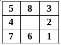
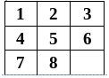
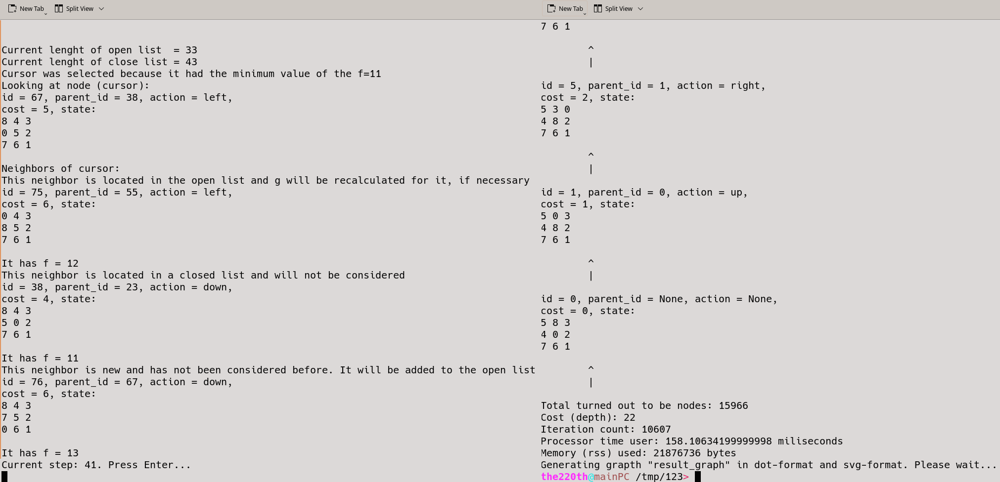
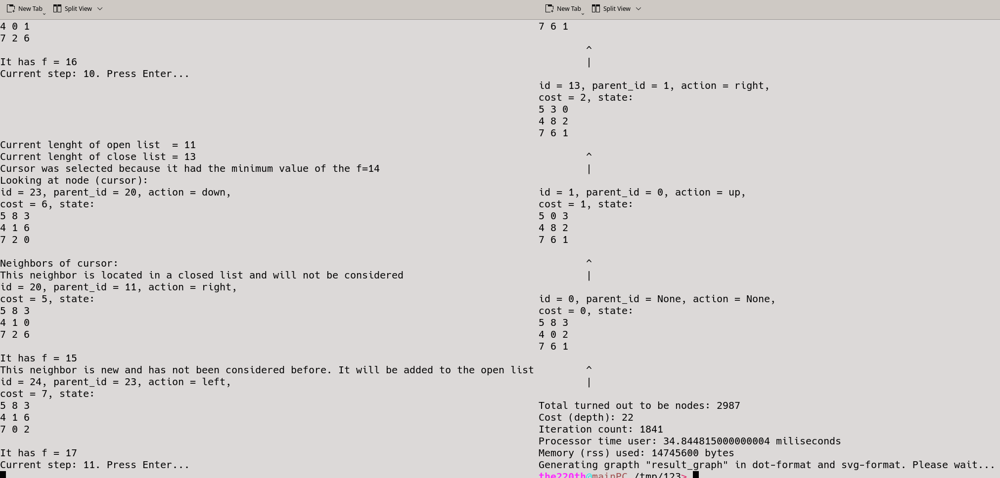
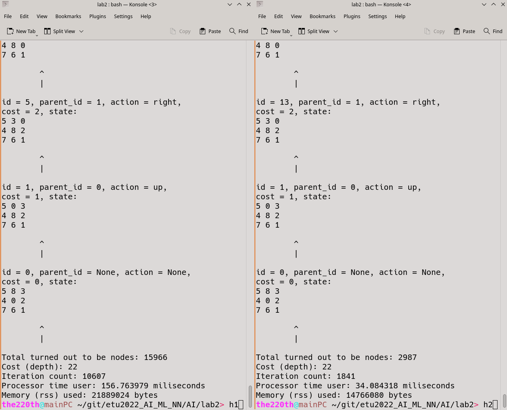

# ВВЕДЕНИЕ

Цель работы: практическое закрепление теоретических основ информированного (эвристического) поиска.

Задачи:

1. Формализовать состояния (выбрать структуру данных). Определить функцию последователей и функцию достижения целевого состояния.

1. Реализовать на любом императивном языке программирования алгоритм поиска решения головоломки «8-ка» с использованием стратегии A* для заданных исходного и целевого состояний. 

1. Отладить программу.

1. Провести эксперемент. Далее экспериментальным путем оценить временную и емкостную сложность решения задачи для двух заданных стратегий.


Вариант 1:

Начальное состояние:



Конечное (целевое) состояние:



Стратегии поиска:

A*

# Описание выбранных структуд данных, представления функции определения последователей

Было решено, что состояния будут представляться массивом на 9 элементов. Пропуск (пустое место) будет обозначаться числом 0. Например, начальное состояние будет представляться, как массив из 9 элементов: [5, 8, 3, 4, 0, 2, 7, 6, 1].

Описание структур данных представлено в таблице 1.

Таблица 1 — описание структур данных

<table border='1'>

<tr>
    <td><b>Структура</b></td>
    <td><b>Описание</b></td>
</tr>

<tr>
    <td>Node</td>
    <td>Пользовательская структура, которая описывает узел. Его поля:
    cur_state - состояние, 
    parent_node - родитель, 
    prev_action - действие, 
    cost = стоимость пути, 
    node_id = id узла.</td>
</tr>

<tr>
    <td>Список</td>
    <td>Список используется для хранения всех когда либо созданных узлов.</td>
</tr>

<tr>
    <td>Словарь</td>
    <td>Словарь используется для хранения узлов. Ключом в словаре используется хэш состояния, по ключу можно получить узел. </td>
</tr>

<tr>
    <td>Хешированное множество</td>
    <td>Хешированное множество (set). Set используется для открытого и закрытого списков  для алгоритма A*. Таким образом можно за O(1) проверить, в каком списке находится узел. </td>
</tr>

<tr>
    <td>Приоритетная очередь на основе кучи</td>
    <td>Используется для получения узла с наименьшей оценочной стоимостью f за O(1). </td>
</tr>

</table>

Функция достижения конечного состояния `check_final` проверяет поэлементно массивы из 9 элементов, представляющие состояния: текущее и конечное.

``` python
# O(1)
def check_state_equals(state1: list, state2: list) -> bool:
    for i in range(9):
        if(state1[i] != state2[i]):
            return False
    return True

# O(1)
def check_final(cur_state: list) -> bool:
    if(check_state_equals(cur_state, get_final_state()) == True):
        return True
    else:
        return False
```

Функция определения последователей `get_next_states` пытается сгенерировать следующие все возможные состояния (соседей курсора).

``` python
class Actions(enum.Enum):
    up = 1
    right = 2
    down = 3
    left = 4

# O(1)
def state_swap(state: list, i: int, j: int) -> list:
    res = list(state)
    res[i], res[j] = res[j], res[i]
    return res

# O(1)
# return new state or None
def shift_state(cur_state: list, where: "Actions") -> list:
    # 0 1 2
    # 3 4 5 
    # 6 7 8
    i = cur_state.index(0)

    if(where == Actions.up):
        if(i in (0, 1, 2)):
            return None
        else:
            return state_swap(cur_state, i, i-3)
    elif(where == Actions.right):
        if(i in (2, 5, 8)):
            return None
        else:
            return state_swap(cur_state, i, i+1)
    elif(where == Actions.down):
        if(i in (6, 7, 8)):
            return None
        else:
            return state_swap(cur_state, i, i+3)
    elif(where == Actions.left):
        if(i in (0, 3, 6)):
            return None
        else:
            return state_swap(cur_state, i, i-1)
    else:
        print("Failed successfully (shift_state)")

# O(1)
def get_next_states(cur_state: list) -> dict:
    res = {}
    for action_i in Actions:
        cur_state_i = shift_state(cur_state, action_i)
        if(cur_state_i != None):
            res[action_i] = cur_state_i
    return res
```

Эвристическая функция `h1` возвращает кол-во "плиток" ("фишек") не на своём месте.

``` python
# O(1)
def h2(state: list) -> int:
    state_final = global_final_state
    res = 0
    for i in range(9):
        state_x, state_y = i // 3, i % 3
        where = state_final.index(state[i])
        final_x, final_y = where // 3, where % 3
        res += abs(final_x-state_x) + abs(final_y-state_y)
    return res
```

Эвристическая функция `h2` возвращает сумму Манхэттенских расстояний "плиток" ("фишек") от из целевой (конечной) позиции.

``` bash
# O(1)
def h2(state: list) -> int:
    state_final = global_final_state
    res = 0
    for i in range(9):
        state_x, state_y = i // 3, i % 3
        where = state_final.index(state[i])
        final_x, final_y = where // 3, where % 3
        res += abs(final_x-state_x) + abs(final_y-state_y)
    return res
```

# Описание алгоритма

A* — это алгоритм поиска, который совмещает в себе жадный поиск и поиск по наилучшему совпадению. Для обеспечения работы этой стратегии вводится оценочная стоимость.

f(x) = g(x) + h(x), где x - это узел.

g(n) – это стоимость пути от начальной вершины до текущей n, а h(n) – это оценочная стоимость самого дешевого, минимального пути из n до цели. f(n) представляет собой оценочную стоимость самого дешевого пути, проходящего через n. 

Стратегия A star, использующая такую целевую функцию, является полной и оптимальной при следующем простом ограничении на функцию h:

- Функция  h не должна переоценивать или завышать стоимость достижения цели. Такая функция называется допустимой или приемлемой в теории поиска.

- Если h является приемлемой, то f(n) никогда не переоценивает реальную стоимость лучшего решения, проходящего через вершину n.

A star поиск является полным, так как по мере расширения контура с разрастанием f, неизбежно достигается контур, у которого f равна стоимости пути и целевому состоянию. A star поиск является оптимально эффективным – никакой другой оптимальный алгоритм не гарантирует нахождения оптимальных вершин эффективнее, чем A star поиск.

BFS поиск, использующий функцию f в качестве оценочной и допустимой называется A star поиск. Особенностью A star поиска является то, что f-стоимость любого пути от корня никогда не убывает, такая эвристическая функция, называется монотонной.

Сам алгоритм:

1. Курсор находится в начальный узел.
2. В открытый список добавляются узлы, которые являются соседями для курсора.
3. Курсор перемещается в узел с наименьшим f(x).
4. Узел, в которую переместился курсор, перемещается из открытого списка в закрытый.
5. Проверка на достижения конечного состояния. Если конечное состояние достигнуто, то конец алгоритма.
6. Происходит оптимизация g(x) для соседних с курсором верших из открытого списка. 
7. Соседние для курсора узлы добавляются в открытый список. Игнорируются узлы из закрытого списка и преграды.
8. Курсор перемешается в узел с наименьшей f.
9. Перейти на 4-ый шаг.

В общем случае порядок временной сложности поиска – O(C^N). Ёмкостная сложность тоже равна O(C^N). 

# Результаты работы

Исходный код реализации представлен в приложении А. В секции `Variable section` можно настроить выполнение так, как необходимо. В том числе переключение между эвристическими функциями h1 и h2 и переключение между сквозным выполнение и пошаговым.

Примеры протоколов выполнения программ для эвристических функций h1 и h2 в пошаговом режиме представлены на рисунках 1 и 2 соответственно.





Эксперементальный замер по времени и памяти при выполнении скрипта представлен на рисунке 3.



Эксперементальные оценки временной и ёмкостной сложности представлены в таблице 2. 

Таблица 2 — Сравнительные оценки

<table border='1'>

<tr>
    <td><b>-</b></td>
    <td><b>BFS (эксперемент)</b></td>
    <td><b>DFS (эксперемент)</b></td>
    <td><b>BFS (шаги, узлы)</b></td>
    <td><b>DFS (шаги, узлы)</b></td>
    <td><b>A* с h1 (эксперемент)</b></td>
    <td><b>A* с h2 (эксперемент)</b></td>
    <td><b>A* с h1 (шаги, узлы)</b></td>
    <td><b>A* с h2 (шаги, узлы)</b></td>
</tr>

<tr>
    <td>Временная</td>
    <td>560 ms</td>
    <td>348 ms</td>
    <td>82409 шагов</td>
    <td>32739 шагов</td>
    <td>157 ms</td>
    <td>34 ms</td>
    <td>10607 шагов</td>
    <td>1841 шагов</td>
</tr>

<tr>
    <td>Ёмкостная</td>
    <td>51708 kB</td>
    <td>48152 kB</td>
    <td>82411 узлов</td>
    <td>55525 узлов</td>
    <td>18180 kB</td>
    <td>14420 kB</td>
    <td>15966 узлов</td>
    <td>2987 узлов</td>
</tr>

</table>

В итоге длина цепочек решения получились следующие:

- A star с эвристической функцией h1: 22 узла

- A star с эвристической функцией h2: 22 узла

Хочется отметить несколько вещей. Python используют свой менеджмент памяти, поэтому показанные результаты можно интепретировать лишь с большой погрешностью. Эвристическая функция h2 явно доминирует над h1 (h2(x) всегда больше, чем h1(x), или равна ей). Используемая память в таблице 2 приведена резидентная.

# Вывод

В ходе выполнения лабораторной работы были изучены некоторые стратегии информированного поиска. Был реализована стратегия A star и использованы 2 разные эвристические функции: число фишек, находящихся в неверной позиции и сумма Манхэттенских расстояний фишек от их целевых позиций. Затем был проведён эксперемент, после которого результаты были сравнены с результатами стратегий неинформированного поиска. В итоге можно сделать несколько выводов:

- Как и ожидалось, A star сильно эффективнее, чем, например, BFS или DFS. Или, другими словами, стратегии информированного поиска эффективнее, чем стратегии неинформированного поиска.

- A star, если правильно подобрать эвристическую функцию, потребляет сильно меньше процессорного времени и памяти по сравнению с BFS и DFS.

- Всегда лучше использовать эвристическую функцию h такую, чтобы h(x) было побольше, но при условии, что h не делает переоценки.

В итоге обязанности членов бригады распределились следующий образом:

<table border='1'>

<tr>
    <td><b>Участник бригады</b></td>
    <td><b>Его задачи</b></td>
</tr>

<tr>
    <td>Участник 1</td>
    <td>Реализация стратегий информированного поиска, написание скрипта, проведение эксперемента по поиску эксперементальной оценки временной и ёмкостной сложности</td>
</tr>

<tr>
    <td>Участник 2</td>
    <td>Формализация задания, выбор структур данных, выбор пользовательских структур данных, реализация эвристических функций, оценка порядков сложностей, реализация визуализации графов</td>
</tr>

<tr>
    <td>Участник 3</td>
    <td>Распределение обязанностей, руководство при реализации стратегий, составление алгоритмов стратегий информированного поиска, поиск решения возникших при разработке вопросов, согласование реализации и формализации, составление отчёта</td>
</tr>

</table>

# Использованные источники

1. Рассел С, Норвиг П. Искусственный интеллект: современный подход, 2-е изд., М. «Вильямс», 2006.

2. Основы теории графов. Date Views 13.09.2022 www.stepik.org.

3. Алгоритм A star. Date Views 13.09.2022 www.neerc.ifmo.ru.

# Приложение А

Исходный код скрипта:

``` python
# -*- coding: utf-8 -*-

import enum
import heapq
import psutil
import os
from time import process_time

'''
============================== Variable section begin ==============================
'''    


GRAPH_VISIALISATION = True

GRAPH_VISIALISATION_FILE_NAME = "result_graph"

# False  -  H1
# True   -  H2
H1_H2 = False

# Если True, то каждый шаг придётся нажимать enter
DEBUG = False


global_final_state = [1, 2, 3, 4, 5, 6, 7, 8, 0]
# Вариант 1
# 5 8 3
# 4 0 2
# 7 6 1
def get_init_state() -> list:
    return [5, 8, 3, 4, 0, 2, 7, 6, 1]

# Вариант 1
# 1 2 3
# 4 5 6
# 7 8 0
def get_final_state() -> list:
    return list(global_final_state)


# O(1)
def heuristics(node: "Node") -> int:
    if(H1_H2 == False):
        cur_value = node.cost + h1(node.cur_state)
    else:
        cur_value = node.cost + h2(node.cur_state)
    return cur_value

'''
============================== Variable section end ==============================
'''


class Actions(enum.Enum):
    # Actions.up.name
    # Actions.up.value
    up = 1
    right = 2
    down = 3
    left = 4


class Nodes_handler():

    __all_nodes = None
    __hashes = None

    @classmethod
    def init(cls):
        cls.__all_nodes = []
        cls.__hashes = {}

    '''
    Если состояние нода повторяется, то не добавится.
    '''
    @classmethod
    def expand_chain(cls, node: "Node"):
        if(cls.check_if_state_consist(node.cur_state) == True):
            return
        cls.__all_nodes.append(node)
        cls.__hashes[cals_state_hash(node.cur_state)] = node

    @classmethod
    def get_all_nodes(cls) -> list:
        return cls.__all_nodes

    # O(1)
    @classmethod
    def check_if_state_consist(cls, state: list) -> bool:
        state_hash = cals_state_hash(state)
        if(state_hash in cls.__hashes):
            return True
        else:
            return False

    # O(1)
    @classmethod
    def get_node_by_state(cls, state: list):
        state_hash = cals_state_hash(state)
        return cls.__hashes[state_hash]

    @classmethod
    def print_state(cls, state: list):
        gi = 0
        for i in range(3):
            for j in range(3):
                print(state[gi], end=" ")
                gi+=1
            print("")
    
    @classmethod
    def print_node(cls, node: "Node"):
        parent_id = None
        if(node.parent_node != None):
            parent_id = node.parent_node.node_id
        node_prev_action = None
        if(node.prev_action != None):
            node_prev_action = node.prev_action.name
        print(f"id = {node.node_id}, parent_id = {parent_id}, action = {node_prev_action}, \ncost = {node.cost}, state: ")
        cls.print_state(node.cur_state)
        print("")

    @classmethod
    def print_chain(cls, node_final: "Node"):
        chain = []
        cur_node = node_final
        while(cur_node.parent_node != None):
            chain.append(cur_node)
            cur_node = cur_node.parent_node
        chain.append(cur_node)
        for node_i in chain:
            cls.print_node(node_i)
            print("\t^\n\t|\n")

class Node:

    cur_state = None
    parent_node = None
    prev_action = None
    cost = None # g
    node_id = None

    #@classvar
    static_node_id = 0

    def __init__(self, state: list, parent: "Node", action: "Actions", cost: int):
        self.cur_state = state
        self.parent_node = parent
        self.prev_action = action
        self.cost = cost

        self.node_id = Node.static_node_id
        Node.static_node_id += 1

    @classmethod
    def get_node_amount(cls) -> int:
        return cls.static_node_id + 1
        


# O(1)
def check_state_equals(state1: list, state2: list) -> bool:
    for i in range(9):
        if(state1[i] != state2[i]):
            return False
    return True

# O(1)
def check_final(cur_state: list) -> bool:
    if(check_state_equals(cur_state, global_final_state) == True):
        return True
    else:
        return False

# O(1)
def cals_state_hash(state: list) -> int:
    hash = 7
    for i in state:
        hash = 31*hash + i
    return hash

def node_to_str(node: "Node") -> str:
    res = f"id={node.node_id}, \ncost = {node.cost}\n"
    state = node.cur_state
    gi = 0
    for i in range(3):
        for j in range(3):
            if(state[gi] == 0):
                res += "- "
            else:
                res += f"{state[gi]} "
            gi+=1
        res += "\n"
    return res


def build_graph(node_id_of_result: int = -1):
    # https://github.com/pydot/pydot
    # https://stackoverflow.com/questions/7670280/tree-plotting-in-python

    print(f"Generating grapth \"{GRAPH_VISIALISATION_FILE_NAME}\" in dot-format and svg-format. Please wait... ")
    import pydot

    graph = pydot.Dot("my_graph", graph_type="graph", bgcolor="white")
    all_nodes = Nodes_handler.get_all_nodes()
    for node_i in all_nodes:
        if(node_i.node_id == node_id_of_result):
            # https://graphviz.org/docs/attrs/fillcolor/
            # https://stackoverflow.com/questions/17252630/why-doesnt-fillcolor-work-with-graphviz
            graph.add_node(pydot.Node(f"node{node_i.node_id}", label=f"{node_to_str(node_i)}", fillcolor="red", style="filled"))
        else:
            graph.add_node(pydot.Node(f"node{node_i.node_id}", label=f"{node_to_str(node_i)}"))
    
    edges = set()
    for node_i in all_nodes:
        if(node_i.parent_node != None):
            edge_name = f"{node_i.node_id}-{node_i.parent_node.node_id}"
            if(edge_name not in edges):
                edges.add(edge_name)
                graph.add_edge(pydot.Edge(f"node{node_i.node_id}", f"node{node_i.parent_node.node_id}", color="black"))
    
    graph.write_raw(f"{GRAPH_VISIALISATION_FILE_NAME}.dot")
    graph.write_svg(f"{GRAPH_VISIALISATION_FILE_NAME}.svg")


# O(1)
def state_swap(state: list, i: int, j: int) -> list:
    res = list(state)
    res[i], res[j] = res[j], res[i]
    return res

# O(1)
# return new state or None
def shift_state(cur_state: list, where: "Actions") -> list:
    # 0 1 2
    # 3 4 5 
    # 6 7 8
    i = cur_state.index(0)

    if(where == Actions.up):
        if(i in (0, 1, 2)):
            return None
        else:
            return state_swap(cur_state, i, i-3)
    elif(where == Actions.right):
        if(i in (2, 5, 8)):
            return None
        else:
            return state_swap(cur_state, i, i+1)
    elif(where == Actions.down):
        if(i in (6, 7, 8)):
            return None
        else:
            return state_swap(cur_state, i, i+3)
    elif(where == Actions.left):
        if(i in (0, 3, 6)):
            return None
        else:
            return state_swap(cur_state, i, i-1)
    else:
        print("Failed successfully (shift_state)")

# O(1)
def get_next_states(cur_state: list) -> dict:
    res = {}
    for action_i in Actions:
        cur_state_i = shift_state(cur_state, action_i)
        if(cur_state_i != None):
            res[action_i] = cur_state_i
    #res = list(filter(lambda x: x != None, res)) # Убрать все None`ы
    return res

# O(1)
def h1(state: list) -> int:
    state_final = global_final_state
    res = 0
    for i in range(9):
        if(state_final[i] != state[i]):
            res+=1
    return res

# O(1)
def h2(state: list) -> int:
    state_final = global_final_state
    res = 0
    for i in range(9):
        state_x, state_y = i // 3, i % 3
        where = state_final.index(state[i])
        final_x, final_y = where // 3, where % 3
        res += abs(final_x-state_x) + abs(final_y-state_y)
    return res

# O(1)
def get_neighbors(with_node: "Node") -> list:
    new_states_dict = get_next_states(with_node.cur_state)
    neighbors = []
    for new_state_move_i in new_states_dict:
        new_state_i = new_states_dict[new_state_move_i]
        if(Nodes_handler.check_if_state_consist(new_state_i) == True):
            neighbors.append(Nodes_handler.get_node_by_state(new_state_i))
        else:
            new_node = Node(new_state_i, with_node, new_state_move_i, with_node.cost+1)
            neighbors.append(new_node)
            Nodes_handler.expand_chain(new_node)
    return neighbors
        
# O(C^N), C - это какая-то константа, N - это глубина решения.
def A_star():
    open_list = set()
    open_list_q = []   #     https://docs.python.org/3/library/heapq.html
    close_list = set()

    cursor = Node(get_init_state(), None, None, 0)
    Nodes_handler.expand_chain(cursor)
    close_list.add(cursor.node_id)

    neighbors = get_neighbors(cursor)
    for neighbor_i in neighbors:
        open_list.add(neighbor_i.node_id)
        neighbor_i_h = heuristics(neighbor_i)
        heapq.heappush(open_list_q, (neighbor_i_h, neighbor_i.node_id, neighbor_i))
    
    iteration_count = 0
    step_i = 0
    while(True):

        heap_lowest = heapq.heappop(open_list_q)
        cursor = heap_lowest[2]
        open_list.remove(cursor.node_id)
        close_list.add(cursor.node_id)
        if(DEBUG):
            print(f"Current lenght of open list  = {len(open_list)}")
            print(f"Current lenght of close list = {len(close_list)}")
            print(f"Cursor was selected because it had the minimum value of the f={heap_lowest[0]}")
            print("Looking at node (cursor): ")
            Nodes_handler.print_node(cursor)

        iteration_count+=1
        if(check_final(cursor.cur_state) == True):
            if(DEBUG):
                print("!!! Answer finded !!!")
                Nodes_handler.print_node(cursor)

            TIME_STOP = process_time()

            Nodes_handler.print_chain(cursor)
            print(f"Total turned out to be nodes: {Node.get_node_amount()}")
            print(f"Cost (depth): {cursor.cost}")
            print(f"Iteration count: {iteration_count}")
            print(f"Processor time user: {(TIME_STOP-TIME_START)*1000} miliseconds")
            print(f"Memory (rss) used: {psutil.Process(os.getpid()).memory_info().rss} bytes")
            if(GRAPH_VISIALISATION):
                build_graph(cursor.node_id)
            exit()

        neighbors = get_neighbors(cursor)

        if(DEBUG):
            print("Neighbors of cursor: ")
            for neighbor_i in neighbors:
                if(neighbor_i.node_id in close_list):
                    print("This neighbor is located in a closed list and will not be considered")
                elif(neighbor_i.node_id in open_list):
                    print("This neighbor is located in the open list and g will be recalculated for it, if necessary")
                else:
                    print("This neighbor is new and has not been considered before. It will be added to the open list")
                Nodes_handler.print_node(neighbor_i)
                print(f"It has f = {heuristics(neighbor_i)}")

        for neighbor_i in neighbors:
            if(neighbor_i.node_id in open_list):
                old_g = neighbor_i.cost
                new_g = cursor.cost + 1
                if(new_g < old_g):
                    neighbor_i.cost = new_g
                    neighbor_i.parent_node = cursor
            else:
                if(neighbor_i.node_id not in close_list):
                    open_list.add(neighbor_i.node_id)
                    neighbor_i_h = heuristics(neighbor_i)
                    heapq.heappush(open_list_q, (neighbor_i_h, neighbor_i.node_id, neighbor_i))

        if(DEBUG):
            print(f"Current step: {step_i}. Press Enter... ")
            input()
            print("\n\n\n")
        step_i += 1
        

TIME_START = None

if __name__ == '__main__':
    Nodes_handler.init()

    TIME_START = process_time()

    A_star()
```